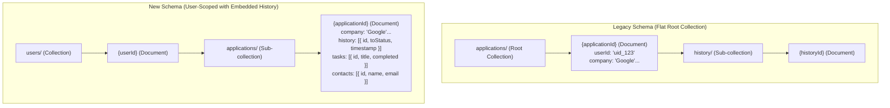

# Product

<!-- impeccable:product-schema 1 -->

## Platform

web

## Users

Job seekers actively applying to multiple roles simultaneously. They are in the middle of a search — juggling applications across LinkedIn, Indeed, Greenhouse, Lever, Wellfound, referrals, and company sites — and need a single place to know where every application stands, what's stale, and what needs action next.

## Product Purpose

Tracklet is a personal job application tracker that gives job seekers a clear, organized view of every application they've sent: its current status, how long it's been in each stage, contacts, notes, and follow-up tasks. It removes the anxiety of losing track across platforms and replaces scattered spreadsheets with a structured, fast, purpose-built tool.

Success means a user can open Tracklet and immediately know: what's active, what needs attention, and what died — without having to think.

## Positioning

Tracklet works without an account (guest mode, localStorage) and without any setup friction; users can start tracking in seconds. It is open-source and self-hostable, giving users full ownership of their data rather than depending on a subscription SaaS. The pipeline board + stats combo in a single focused tool mirrors how job seekers actually think about their search, not how ATS vendors think about hiring.

## Operating Context

Users interact with Tracklet during or right after applying for jobs — often daily during an active search. Typical rituals: logging a new application after submitting it, checking the pipeline board to see what's stale, updating a status after hearing back from a recruiter, and reviewing stats to understand search  velocity. The tool should be fast and low-friction, never in the user's way.

## Capabilities and Constraints

- **Status stages:** Applied → Screening → Interview → Offer → Rejected / Archived
- **Platforms tracked:** LinkedIn, Indeed, Lever, Greenhouse, Otta, Company Site, Referral, Wellfound, Other
- **Per-application data:** company, role, platform, date applied, status, job link, notes, contacts (name, role, email, phone, LinkedIn, notes), tasks (title, due date, completed), logo/domain, status history
- **Views:** All Applications table (sortable, filterable, bulk actions), Active Pipeline board (kanban), Stats view, Settings view
- **Auth:** Google Sign-In via Firebase (optional; guest mode uses localStorage)
- **Persistence:** Firestore for authenticated users; localStorage for guests
- **AI dependency present** (`@google/genai`) — specific AI features undecided/undocumented at this time
- **Export/Import:** CSV export of filtered applications; CSV batch import
- **Expiry notifications:** configurable threshold for flagging stale applications
- **Deployment:** Firebase Hosting (public web app); open-source / potentially self-hostable

## Brand Commitments

Name: **Tracklet** — short, purposeful, tool-like. No confirmed tagline, logo, or color palette yet.

## Evidence on Hand

- Full working codebase: React 19 + Vite + TypeScript + TailwindCSS v4 + Firebase + Framer Motion
- Sample/seed data exists in `src/lib/sampleData` for demo experience
- No marketing copy, testimonials, press, or logo assets confirmed at this time — future work must not fabricate them

## Product Principles

1. **Zero friction first.** The tool must never slow down a user who just finished applying. Logging, updating, and reviewing should take seconds.
2. **Clarity over completeness.** Show the user what matters right now — active applications, stale stages, next actions — rather than an overwhelming data dump.
3. **User-owned data.** Whether guest or authenticated, users control their records. No lock-in, no required accounts, open-source as a credibility signal.
4. **Tool, not platform.** Tracklet is a focused utility. It does one job extremely well and doesn't try to become a career platform or coaching product.
5. **Honest empty states.** When there's nothing to show, the UI should be genuinely helpful — prompt the right next action, never fake activity.

## Accessibility & Inclusion

Standard web accessibility (WCAG 2.1 AA) is the baseline for Tracklet, with keyboard shortcuts, high contrast WCAG-compliant colors, screen reader ARIA annotations, and motion-reduction support.

## Data Model & Architecture

