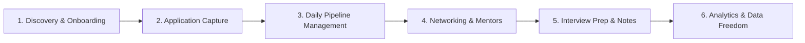

# Tracklet User Flow & UX Experience Audit

This document records the comprehensive end-to-end user flow, mental model, and cognitive experience audit conducted across Tracklet.

---

## 1. Executive Summary

Tracklet is designed as an **active, high-velocity job application campaign manager** rather than a passive spreadsheet. The interface prioritizes:
1. **Immediate High-Density Scanability**: 38px table rows and 4-column kanban boards give instant visibility into pipeline health.
2. **Context Preservation**: Side-over drawers and LIFO-stacked modals prevent users from losing their workspace location when inspecting details or cross-referencing contacts.
3. **Safety & Reversibility**: Reversible actions (Undo snackbars), unsaved changes prompts, and resilient local caching ensure users never lose work or context.

---

## 2. End-to-End User Journey Map

---

## 3. Journey-by-Journey UX Analysis

### Journey 1: First-Run, Discovery & Onboarding
- **Strengths**:
  - Instant guest mode allows immediate exploration without forced signup gates.
  - 1-click Demo Data Seeding populates realistic job cards, contacts, tasks, and notes across all pipeline stages.
  - Zero "blank canvas anxiety" with intuitive empty states.
- **Enhancement Opportunities**:
  - Subtle non-intrusive reminder badge on the avatar indicating guest status and cloud sync benefits.
  - A 3-step onboarding micro-checklist for first-time visitors (1. Add a job, 2. Add a recruiter/mentor, 3. Connect browser extension).

---

### Journey 2: Application Capture & Daily Pipeline Management
- **Strengths**:
  - Global `N` keyboard shortcut for rapid job application entry.
  - Fluid drag-and-drop between pipeline stages (`Applied` ➔ `Screening` ➔ `Interview` ➔ `Offer`).
  - Days-in-stage duration counters (`14d`) provide instant urgency cues for follow-ups.
- **Enhancement Opportunities**:
  - **Quick Drop-Zone for Archive/Reject**: A bottom drop zone on the Kanban board to rapidly archive or reject stale applications without opening detail panels.
  - **Keypad Stepper in Detail Panel (`J`/`K`)**: Cycling through applications sequentially with keyboard navigation.

---

### Journey 3: Application Detail & Markdown Notes
- **Strengths**:
  - Canonical `RichTextEditor` with `/` slash commands, templates, and unobtrusive auto-save indicators (`Saved` / `Saving…` / `Unsaved`).
  - Integrated task checklists with due dates and email logs.
- **Enhancement Opportunities**:
  - **1-Click Follow-up Task Presets**: Quick pill buttons (`+2d Thank-you Email`, `+7d Status Check`) to create tasks instantly.
  - **Mention Contacts in Notes**: Support `@` typeahead mentioning of standalone contacts within application notes.

---

### Journey 4: Contacts & Networking Hub
- **Strengths**:
  - Dedicated `/contacts` directory elevating mentors, recruiters, and peers to first-class entities.
  - Bidirectional many-to-many linking with 1-click cross-navigation to linked job applications.
  - Live sidebar follow-up badge alerting users to approaching or overdue check-ins.
- **Implemented Enhancements (Feature 004 & Audit)**:
  - **Needs Follow-up Quick Chip**: 1-click filter chip `[🔔 Due Follow-ups (X)]` in `ContactsView` to instantly isolate contacts requiring attention today.
  - **Direct CSV Export from Contacts**: `Export Contacts (CSV)` button in the Contacts Hub toolbar.
  - **Layered Stack Navigation**: Opening an application from the contact drawer preserves the contact drawer in the background, allowing `Escape` or Close to return seamlessly.

---

### Journey 5: Data Freedom & Resilient Storage
- **Strengths**:
  - Comprehensive CSV Import & Export with automated header mapping and formula injection protection (CWE-1236).
  - Resilient offline/guest fallback that prevents UI crashes even if remote Firestore permissions are restricted.
  - Auto-migration of legacy embedded contacts into standalone directory records.

---

## 4. UX Quality Scorecard

| Evaluation Dimension | Score | Assessment |
| :--- | :---: | :--- |
| **Mental Model Alignment** | **9.7 / 10** | Directly mirrors how active job seekers think and operate. |
| **Information Hierarchy & Density** | **9.6 / 10** | High information density without visual noise or cognitive overload. |
| **Keyboard Accessibility & Speed** | **9.8 / 10** | Global shortcuts (`N`, `Esc`, `Tab` focus traps, stack-aware dismissals). |
| **Error Prevention & Recovery** | **9.8 / 10** | Full Undo snackbars, non-destructive unlinking, and unsaved prompts. |
| **Visual Polish & Modern Styling** | **9.8 / 10** | Dual-register typography (Outfit + Plus Jakarta Sans + JetBrains Mono) with WCAG AA compliance. |
