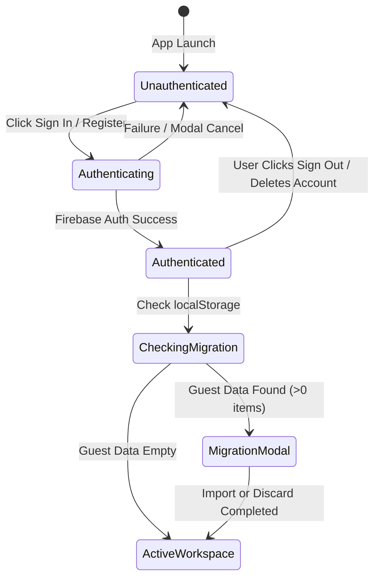
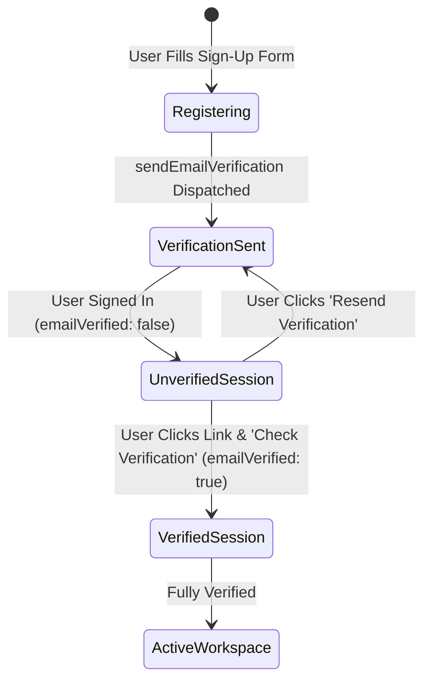

# Data Model: Production Authentication & Account Management

**Feature Branch**: `002-auth-system`  
**Date**: 2026-08-16  

---

## 1. Entity Definitions

### `AuthUser`
Encapsulates sanitized authenticated user state for Tracklet.

```typescript
export interface AuthUser {
  uid: string;
  email: string | null;
  displayName: string | null;
  photoURL: string | null;
  providerId: 'google.com' | 'password' | string;
  emailVerified: boolean;
  creationTime?: string;
  lastSignInTime?: string;
}
```

### `AuthViewMode`
Controls the active view inside the authentication modal.

```typescript
export type AuthViewMode = 'signin' | 'signup' | 'forgot-password';
```

### `GuestMigrationPayload`
Data payload passed when transitioning from an active guest session to an authenticated cloud account.

```typescript
export interface GuestMigrationPayload {
  guestApplications: Application[];
  count: number;
}
```

---

## 2. Storage & Firestore Mapping

### Firestore Collections & Documents

```
/databases/(default)/documents/
  ├── applications/
  │   └── {applicationId}
  │         ├── id: string
  │         ├── userId: string (matches request.auth.uid)
  │         ├── company: string
  │         ├── role: string
  │         ├── status: ApplicationStatus
  │         ├── platform: ApplicationPlatform
  │         ├── location: string
  │         ├── salary: string
  │         ├── jobLink: string
  │         ├── dateApplied: string
  │         ├── stageUpdatedAt: string
  │         ├── notes: string
  │         ├── followUpTasks: Task[]
  │         ├── contacts: Contact[]
  │         ├── createdAt: string
  │         ├── updatedAt: string
  │         └── history/ [sub-collection]
  │               └── {historyId}
  │                     ├── toStatus: ApplicationStatus
  │                     ├── fromStatus?: ApplicationStatus
  │                     └── timestamp: string
```

### LocalStorage Keys

| Key | Purpose | Scope |
|-----|---------|-------|
| `tracklet_guest_applications` | Holds job records created while in unauthenticated Guest mode | Guest Only |
| `tracklet_expiry_settings` | Notification window preferences | Global |

---

## 3. State Transitions

### Auth State Flow



### Email Verification State Flow


