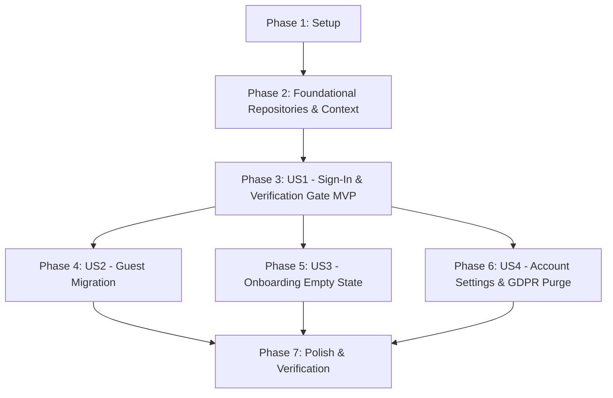

# Tasks: Production Authentication & Strict Email Verification Gate

**Input**: Design documents from `specs/002-auth-system/`  
**Prerequisites**: [plan.md](file:///d:/Programming/Tracklet/specs/002-auth-system/plan.md), [spec.md](file:///d:/Programming/Tracklet/specs/002-auth-system/spec.md), [research.md](file:///d:/Programming/Tracklet/specs/002-auth-system/research.md), [data-model.md](file:///d:/Programming/Tracklet/specs/002-auth-system/data-model.md), [contracts/](file:///d:/Programming/Tracklet/specs/002-auth-system/contracts/)

---

## Phase 1: Setup (Shared Infrastructure & Types)

**Purpose**: Define entity types, constants, and error translation utilities.

- [X] T001 [P] Add `AuthUser`, `AuthViewMode`, and `GuestMigrationPayload` types in `src/types.ts`
- [X] T002 [P] Define authentication storage keys and provider constants in `src/lib/constants.ts`
- [X] T003 [P] Implement Firebase Auth error code mapper with user-friendly messages in `src/lib/authErrors.ts`

---

## Phase 2: Foundational (Core Auth & Application Repositories)

**Purpose**: Build the core repository layer and context provider that MUST be completed before UI story components can interact with auth or database state.

**⚠️ CRITICAL**: Blocking prerequisite for all user stories.

- [X] T004 Clean up Firebase exports in `src/lib/firebase.ts` to expose initialized `auth` and `db` instances
- [X] T005 Implement `AuthRepository` in `src/lib/authRepository.ts` encapsulating all Firebase Auth SDK methods (`signInWithPopup`, `signInWithEmail`, `signUpWithEmail`, `sendEmailVerification`, `reloadUser`, `sendPasswordReset`, `signOut`, `deleteAccount`)
- [X] T006 Update `ApplicationRepository` in `src/lib/applicationRepository.ts` to remove auto-mock data seeding on empty accounts and add `purgeUserData(userId)`
- [X] T007 Implement `AuthContext` and `useAuth()` custom hook in `src/context/AuthContext.tsx` consuming `AuthRepository`

**Checkpoint**: Foundation ready — all authentication actions and database operations are encapsulated in repositories and ready for UI consumption.

---

## Phase 3: User Story 1 - Multi-Provider Sign-In & Strict Email Verification Gate (Priority: P1) 🎯 MVP

**Goal**: Provide Google OAuth and Email/Password authentication with a strict blocking screen for unverified users that persists across page reloads and browser restarts.

**Independent Test**: Register with an email address, verify that the `EmailVerificationGate` blocks the dashboard on initial load and after page refresh, click the verification link in email, click "I've Verified My Email", and verify immediate workspace access.

### Implementation for User Story 1

- [X] T008 [P] [US1] Create `EmailVerificationGate` component in `src/components/EmailVerificationGate.tsx` with email display, "I've Verified My Email" check, "Resend Verification Email" (with 60s cooldown timer), and "Sign Out" action
- [X] T009 [P] [US1] Create `AuthModal` dialog in `src/components/AuthModal.tsx` supporting Google Sign-In, Email Sign-In, Account Registration (with verification dispatch), and Password Reset
- [X] T010 [US1] Connect `src/components/Sidebar.tsx` to `useAuth()` to trigger `openAuthModal()` on click and render user avatar/email profile
- [X] T011 [US1] Wrap `src/App.tsx` with `<AuthProvider>` and intercept rendering with `<EmailVerificationGate>` whenever an authenticated user has `emailVerified: false`

**Checkpoint**: User Story 1 fully functional. Unverified accounts cannot enter the dashboard across reloads; verified users and Google OAuth users enter smoothly.

---

## Phase 4: User Story 2 - Explicit Guest-to-Account Data Migration (Priority: P1)

**Goal**: Seamlessly detect existing guest applications when a verified user logs in and present an explicit modal to import or discard them.

**Independent Test**: Add 2 applications as guest, log in with a verified account, confirm `GuestMigrationModal` appears, click "Import to Account", and verify applications exist in Firestore under the user's UID.

### Implementation for User Story 2

- [X] T012 [P] [US2] Create `GuestMigrationModal` component in `src/components/GuestMigrationModal.tsx` showing the count of local guest jobs with "Import to Account" and "Discard & Start Fresh" actions
- [X] T013 [US2] Integrate guest migration detection in `src/App.tsx` for verified users and execute batch upload via `ApplicationRepository.batchImport`

**Checkpoint**: User Stories 1 AND 2 working together. Guest data is never silently overwritten or lost.

---

## Phase 5: User Story 3 - First-Time Onboarding Without Mock Data Pollution (Priority: P2)

**Goal**: Ensure newly registered users see a clean empty workspace with an onboarding hero card instead of unwanted fake mock jobs.

**Independent Test**: Register and verify a brand-new account, confirm 0 applications exist on the board, and verify "Reload Sample Demo Data" in Settings functions on demand.

### Implementation for User Story 3

- [X] T014 [P] [US3] Create `OnboardingEmptyState` component in `src/components/OnboardingEmptyState.tsx` with "Log Your First Application" and "Load Sample Demo Data" actions
- [X] T015 [US3] Integrate `OnboardingEmptyState` into `src/components/AllApplicationsTable.tsx` and `src/components/ActivePipelineBoard.tsx` when 0 total applications exist

**Checkpoint**: Clean onboarding experience for new users with explicit demo data loading.

---

## Phase 6: User Story 4 - User Profile, Account Management & GDPR Purge (Priority: P2)

**Goal**: Provide self-service account details in Settings, verified status badges, and a GDPR-compliant permanent account & data purge flow.

**Independent Test**: In Settings > Account, view account details, click "Delete Account & Data", type "DELETE", and verify all user documents and the Firebase Auth account are deleted.

### Implementation for User Story 4

- [X] T016 [P] [US4] Create `AccountSettingsCard` component in `src/components/AccountSettingsCard.tsx` with user email, verification status badge, password reset trigger, and destructive account deletion dialog
- [X] T017 [US4] Embed `AccountSettingsCard` in `src/components/SettingsView.tsx` and wire destructive purge through `ApplicationRepository.purgeUserData` and `AuthRepository.deleteAccount`

**Checkpoint**: Complete user account lifecycle and privacy compliance.

---

## Phase 7: Polish & Cross-Cutting Concerns

**Purpose**: Eliminate legacy architectural violations, verify build integrity, and test scenarios end-to-end.

- [X] T018 Refactor all remaining raw Firestore queries and batch mutations in `src/App.tsx` to route 100% through `ApplicationRepository`
- [X] T019 Run type check validation with `npx tsc --noEmit` and resolve any type discrepancies
- [X] T020 Run production build with `npm run build` and validate all scenarios in `specs/002-auth-system/quickstart.md`

---

## Dependencies & Execution Order

### Phase Dependencies

### Parallel Opportunities

- **Phase 1 (Setup)**: `T001`, `T002`, `T003` can all be executed in parallel (independent files).
- **Phase 3 (US1)**: `T008` (`EmailVerificationGate`) and `T009` (`AuthModal`) can be built in parallel.
- **Phase 4, 5, 6**: Once Phase 3 is in place, `T012` (`GuestMigrationModal`), `T014` (`OnboardingEmptyState`), and `T016` (`AccountSettingsCard`) can be built in parallel.

---

## Implementation Strategy

### MVP First (User Story 1 Only)
1. Complete Phase 1 (Setup: Types, Constants, Error Translation)
2. Complete Phase 2 (Foundational: `AuthRepository`, `ApplicationRepository`, `AuthContext`)
3. Complete Phase 3 (US1: `EmailVerificationGate`, `AuthModal`, `Sidebar`, `App.tsx` gate integration)
4. **VALIDATE MVP**: Register test account → confirm email verification gate blocks access → verify link → confirm unlock.

### Incremental Delivery
- Deliver US1 (Core Multi-Provider Auth + Strict Verification Gate)
- Deliver US2 (Guest Data Migration)
- Deliver US3 (Clean Slate Onboarding)
- Deliver US4 (Account Management & GDPR Data Purge)
- Final Polish & Clean Repository Verification
