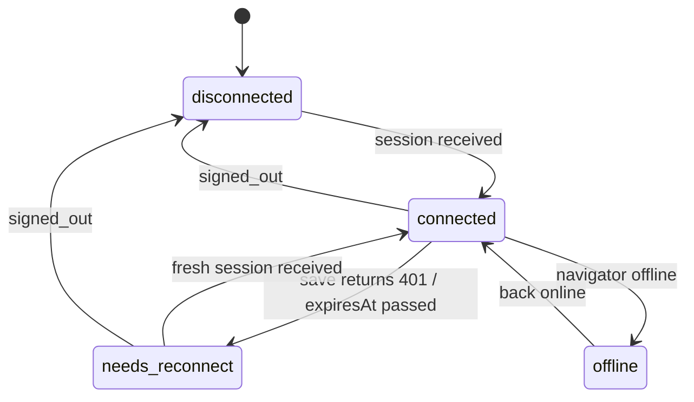

# Data Model: Extension Session

No Firestore or `Application` model changes. Only extension-local state.

## ExtensionSession (`chrome.storage.local.tracklet_user_session`)

| Field | Type | Required | Notes |
|---|---|---|---|
| `uid` | string | yes | Firebase user id |
| `email` | string \| null | no | Display only |
| `idToken` | string | yes | Firebase short-lived ID token used for Firestore REST |
| `refreshToken` | string | yes | **new**, Firebase long-lived refresh token for autonomous cloud refresh |
| `expiresAt` | number (ms epoch) | no | **new**, token expiration timestamp |
| `needsReconnect` | boolean | no | **new**, set if refresh token is revoked |
| `syncedAt` | number (ms epoch) | no | **new**, last time web app synced credentials |

Absent key / `null` ⇒ not connected.

## SessionMessage (web → content script → background)

| Field | Type | Notes |
|---|---|---|
| `user` | `{uid, email, idToken, refreshToken}` \| null | Includes `refreshToken` for independent background operation |
| `config` | `{projectId, apiKey}` | |
| `reason` | `'session' \| 'signed_out'` | **new**; `null` user without `reason: 'signed_out'` is ignored |

## Connection state (derived in popup, not stored)

Derivation order: `!navigator.onLine` → `offline`; no session → `disconnected`; `needsReconnect || expiresAt < now` → `needs_reconnect`; else `connected`.

## Validation rules

- A session is stored only if `uid` and `idToken` are non-empty strings.
- `null` user is applied only with `reason === 'signed_out'`.
- Account switch (`uid` differs from stored): replace the session. The pending queue is untouched, and the existing web-app guest migration handles attribution.
