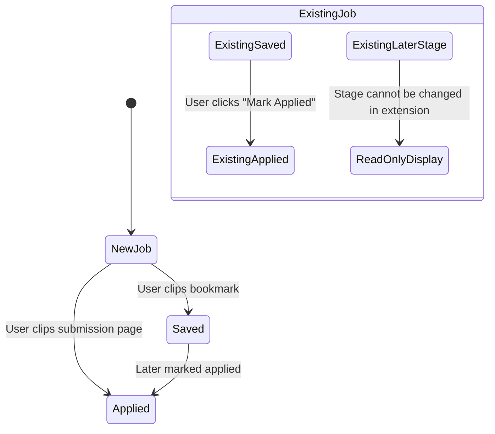

# Data Model: Extension Capture Quality

This document defines the data models, entity relationships, validation rules, and state transitions for job and contact extraction in the Tracklet browser extension.

---

## 1. Extracted Entities

### `ExtractedPageData` (Content Script → Popup)
The raw extracted data produced by `extension/content.js` when querying the active tab.

| Field | Type | Required | Description |
|---|---|---|---|
| `role` | `string` | Yes | Extracted job title (e.g. "Senior Frontend Engineer") |
| `company` | `string` | Yes | Hiring company name (e.g. "Stripe") |
| `companyDomain` | `string \| null` | No | Extracted canonical domain (e.g. "stripe.com"), NEVER a job board or ATS |
| `logoUrl` | `string \| null` | No | Durable logo image URL or undefined |
| `platform` | `JobPlatform` | Yes | 'LinkedIn' \| 'Indeed' \| 'Lever' \| 'Greenhouse' \| 'Otta' \| 'Wellfound' \| 'Company Site' \| 'Other' |
| `jobLink` | `string` | Yes | Full normalized URL of the job posting |
| `location` | `string \| null` | No | Geographical location (e.g. "Berlin, Germany") |
| `workLocation` | `WorkLocation \| null` | No | 'Remote' \| 'Hybrid' \| 'Onsite' |
| `employmentType` | `EmploymentType \| null` | No | 'Full-time' \| 'Part-time' \| 'Contract' \| 'Internship' |
| `notes` | `string \| null` | No | Highlighted text, or bounded plain-text summary of job description |
| `suggestedStage` | `'Saved' \| 'Applied'` | Yes | 'Applied' if confirmation/thank-you page, else 'Saved' |
| `contact` | `ExtractedContact \| null` | No | Hiring manager or recruiter detected on the posting |
| `isWebmail` | `boolean` | No | True if active page is Gmail/Outlook thread |

---

### `ExtractedContact` (Recruiter / Poster)
Detected job poster or recruiter details extracted from LinkedIn or job board markup.

| Field | Type | Required | Description |
|---|---|---|---|
| `name` | `string` | Yes | Full name (e.g. "Jane Doe") |
| `role` | `string \| null` | No | Professional title (e.g. "Technical Recruiter") |
| `organization` | `string \| null` | No | Associated company name |
| `linkedIn` | `string \| null` | No | Cleaned LinkedIn profile URL (`https://www.linkedin.com/in/...`) |
| `email` | `string \| null` | No | Direct contact email if present in description |
| `category` | `ContactCategory` | Yes | Defaults to `'Recruiter'`; `'Hiring Manager'` if title indicates hiring lead |

---

### `JobBoardRegistry` (Single Source of Truth)
Defined in `src/lib/jobBoardRegistry.ts` (web app) and mirrored in `extension/jobBoardRegistry.js` (extension).

```typescript
export interface JobBoardRegistry {
  jobBoardHosts: Set<string>;
  atsHosts: Set<string>;
  isJobBoardOrAts(hostnameOrUrl: string): boolean;
  cleanCompanyDomain(urlOrHost: string): string | null;
}
```

#### Core Registry Contents:
- **Job Boards**: `linkedin.com`, `indeed.com`, `glassdoor.com`, `ziprecruiter.com`, `monster.com`, `simplyhired.com`, `otta.com`, `wellfound.com`, `angel.co`, `dice.com`, `careerbuilder.com`, `jobserve.com`, `totaljobs.com`, `reed.co.uk`, `cwjobs.co.uk`
- **ATS Hosts**: `greenhouse.io`, `lever.co`, `ashbyhq.com`, `workdayjobs.com`, `myworkdayjobs.com`, `smartrecruiters.com`, `jobvite.com`, `recruitee.com`, `rippling-ats.com`, `bamboohr.com`, `icims.com`, `jazzhr.com`, `workable.com`, `breezy.hr`

---

## 2. Persistence Entities (Tracklet Application & Contact)

When saved, the data maps directly to Tracklet's existing models in `src/types.ts`:

### `Application` (Target Model)
No schema migration required. Existing fields are now populated accurately:
- `company`: `string` (hiring company, e.g. "Stripe")
- `role`: `string`
- `platform`: `JobPlatform`
- `jobLink`: `string`
- `companyDomain`: `string` (sanitized company domain, e.g. "stripe.com")
- `logoUrl`: `string | undefined`
- `location`: `string | undefined` (e.g. "San Francisco, CA")
- `workLocation`: `'Remote' | 'Hybrid' | 'Onsite' | undefined`
- `employmentType`: `'Full-time' | 'Part-time' | 'Contract' | 'Internship' | undefined`
- `notes`: `string | undefined`
- `status`: `'Saved' | 'Applied'` (or preserved existing status)
- `stageUpdatedAt`: ISO string
- `history`: `StatusHistoryEntry[]`
- `contactIds`: `string[]`

### `Contact` (Created if user accepts recruiter card)
- `id`: `string` (`cnt-` prefix)
- `userId`: `string`
- `name`: `string`
- `role`: `string | undefined`
- `organization`: `string | undefined`
- `category`: `'Recruiter' | 'Hiring Manager'`
- `linkedIn`: `string | undefined`
- `applicationIds`: `[application.id]`
- `createdAt`: ISO string
- `updatedAt`: ISO string

---

## 3. Stage State Machine & Preservation Rules



### Transition Rules:
1. **New Job**:
   - Only `Saved` and `Applied` are selectable.
   - Initial selection: `Applied` if submission confirmation page detected, otherwise `Saved`.
   - Initial history: `[{ id, toStatus: status, timestamp: nowISO, note: 'Added via Tracklet extension' }]`.
2. **Existing Job at `Saved`**:
   - User can advance to `Applied`.
   - Appends to history: `{ id, fromStatus: 'Saved', toStatus: 'Applied', timestamp: nowISO, note: 'Applied via Tracklet extension' }`.
   - Updates `stageUpdatedAt: nowISO`.
3. **Existing Job at any later stage (`Applied`, `Screening`, `Interview`, `Offer`, `Rejected`, `Archived`)**:
   - The stage is **immutable in the extension**.
   - Shown as a read-only badge with stage color.
   - Saves from the extension update other details (notes, contact, link) while leaving `status`, `stageUpdatedAt`, and `history` untouched.

---

## 4. Validation Rules

- **FR-001 / FR-002**: `isJobBoardOrAts(companyDomain) === false`. If a candidate domain matches the registry, it must be cleared to `""`.
- **FR-003**: `logoUrl` must not contain any host matching `isJobBoardOrAts`.
- **FR-007 / FR-009**:
  - `workLocation` must strictly be one of `['Remote', 'Hybrid', 'Onsite']` or `undefined`.
  - `employmentType` must strictly be one of `['Full-time', 'Part-time', 'Contract', 'Internship']` or `undefined`.
- **FR-010**: All extracted fields displayed in the extension popup are editable; the form value submitted by the user always overrides automated extraction.
- **FR-011**: Recruiter contact is checked for duplicates against existing contacts by `linkedIn` URL and `email` before creating a new record.
