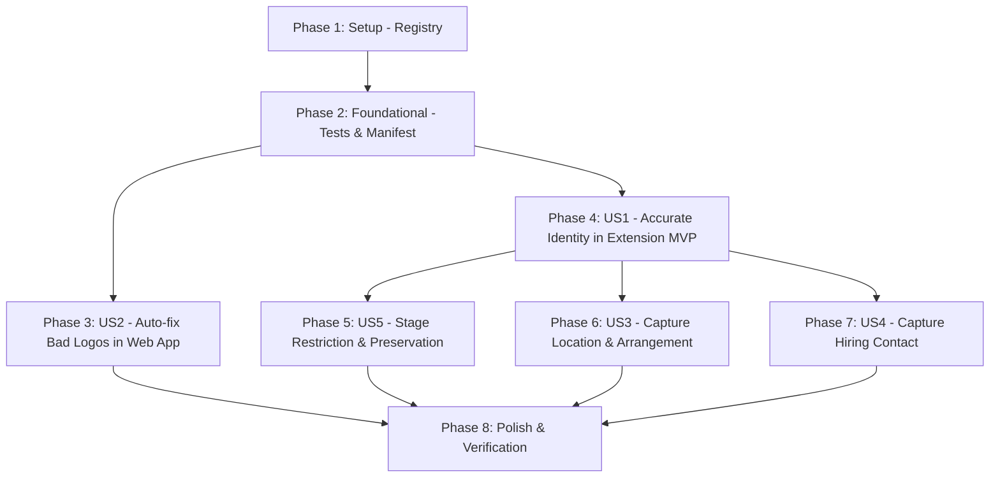

# Tasks: Extension Capture Quality

**Input**: Design documents from `/specs/007-extension-capture-quality/`  
**Prerequisites**: [plan.md](./plan.md), [spec.md](./spec.md), [research.md](./research.md), [data-model.md](./data-model.md), [contracts/capture-protocol.md](./contracts/capture-protocol.md)

---

## Phase 1: Setup (Shared Infrastructure)

**Purpose**: Establish the single canonical Job Board & ATS Registry across web app and extension.

- [ ] T001 Create canonical Job Board & ATS Registry in `src/lib/jobBoardRegistry.ts`
- [ ] T002 Create mirrored Job Board & ATS Registry in `extension/jobBoardRegistry.js`
- [ ] T003 Update `extension/manifest.json` to load `jobBoardRegistry.js` in content scripts and popup

---

## Phase 2: Foundational (Blocking Prerequisites)

**Purpose**: Core unit tests and infrastructure that MUST be in place before user stories.

- [ ] T004 [P] Create unit tests for Job Board Registry in `tests/unit/jobBoardRegistry.test.ts`
- [ ] T005 [P] Create unit tests for logo sanitization and bad-domain filtering in `tests/unit/logoUtils.test.ts`

**Checkpoint**: Foundation ready — registry tests pass and extension manifest loads registry.

---

## Phase 3: User Story 2 - Existing Bad Logos Fix Themselves (Priority: P1)

**Goal**: Jobs already saved with a job board's website or logo display correctly without manual edits.

**Independent Test**: An existing application with `companyDomain: "linkedin.com"` or `logoUrl: "https://logo.clearbit.com/linkedin.com"` renders a monogram or correct company logo in table/board views, and email matching ignores board domains.

### Implementation for User Story 2
- [ ] T006 [US2] Update `getCompanyDomain` and `getCompanyLogoUrls` in `src/lib/logoUtils.ts` to discard any `customDomain` or `customLogoUrl` matching `isJobBoardOrAts`
- [ ] T007 [US2] Update `src/lib/emailMatchingUtils.ts` to ignore job-board domains when matching sender emails to jobs
- [ ] T008 [US2] Verify `tests/unit/logoUtils.test.ts` passes with 100% green assertions on job-board rejection

**Checkpoint**: Existing corrupted records in Tracklet display with clean monograms and correct company branding.

---

## Phase 4: User Story 1 - The Right Company Identity & Logo (Priority: P1) 🎯 MVP

**Goal**: When saving from LinkedIn, Indeed, Greenhouse, Lever, Workday, etc., the extension captures the hiring company's identity and logo, never the board's.

**Independent Test**: Clip a job on LinkedIn, Indeed, and Greenhouse. In each case, the popup and saved record show the employer's logo/domain, never the job board's.

### Implementation for User Story 1
- [ ] T009 [US1] Implement prioritized company domain extraction in `extension/content.js` (JSON-LD `sameAs` / `hiringOrganization.url`, ATS slug parser, known company dictionary, careers site subdomain stripper)
- [ ] T010 [US1] Update `extension/popup.html` to add editable Company Domain input with live logo avatar preview
- [ ] T011 [US1] Update `updateCompanyAvatar` in `extension/popup.js` to resolve high-res Google Favicon with monogram fallback, removing deprecated Clearbit URL dependency
- [ ] T012 [US1] Update `extension/popup.js` to bind domain input edits to live avatar preview and save payload
- [ ] T013 [US1] Update context menu save handler in `extension/background.js` to use extracted domain and remove `logo.clearbit.com` hardcoding

**Checkpoint**: New clips from LinkedIn and ATS sites record the real employer domain and display clean logos.

---

## Phase 5: User Story 5 - Stage is Saved or Applied & Preserves Progress (Priority: P1)

**Goal**: Extension limits new captures to "Saved" or "Applied", detects confirmation pages, and never overwrites later stages or destroys stage history.

**Independent Test**: (1) New clip only offers Saved/Applied. (2) Re-saving a job at "Interview" shows stage as read-only and retains Interview status and history.

### Implementation for User Story 5
- [ ] T014 [US5] Add page heuristic in `extension/content.js` to detect confirmation/thank-you URLs and suggest `Applied`
- [ ] T015 [US5] Restrict stage dropdown in `extension/popup.html` and `extension/popup.js` to `Saved` and `Applied` for new jobs
- [ ] T016 [US5] Add read-only stage badge state in `extension/popup.html` and `extension/popup.css` for existing jobs at later stages (`Screening`, `Interview`, `Offer`, etc.)
- [ ] T017 [US5] Update duplicate detection in `extension/popup.js` to switch stage UI to read-only when existing job is past `Saved`
- [ ] T018 [US5] Update save handling in `extension/popup.js` and `extension/background.js` to append `StatusHistoryEntry` on Saved → Applied, and preserve existing `status` and `history` without overwriting

**Checkpoint**: Stage progress cannot be accidentally reset from the extension clipper.

---

## Phase 6: User Story 3 - Capture Details Tracklet Already Tracks (Priority: P1)

**Goal**: Pre-fill Location, Work Arrangement (Remote/Hybrid/Onsite), Employment Type, and Description Summary directly from postings.

**Independent Test**: Clip a job stating "Remote · Full-time · Berlin, Germany". All three appear pre-selected and editable in popup and persist to Tracklet.

### Implementation for User Story 3
- [ ] T019 [US3] Implement Location, Work Arrangement, and Employment Type extraction in `extension/content.js` (JSON-LD + site-specific DOM for LinkedIn, Indeed, Greenhouse, Lever, Workday)
- [ ] T020 [US3] Implement bounded plain-text description summary in `extension/content.js` (yielding to user-highlighted text if present)
- [ ] T021 [US3] Add Work Arrangement and Employment Type selectable pills and Location input in `extension/popup.html` and `extension/popup.css`
- [ ] T022 [US3] Wire extracted attributes into popup inputs and include in `basePayload` in `extension/popup.js`
- [ ] T023 [US3] Update `background.js` Firestore field mappings to write `location`, `workLocation`, and `employmentType`

**Checkpoint**: Applications captured via extension arrive fully populated with location, work arrangement, and employment type.

---

## Phase 7: User Story 4 - Capture the Hiring Contact (Priority: P2)

**Goal**: Detect recruiter or job poster on postings and offer one-click creation in Contacts Hub.

**Independent Test**: Clip a LinkedIn job showing a job poster. Popup shows recruiter card. Saving creates and links the contact in Contacts Hub.

### Implementation for User Story 4
- [ ] T024 [US4] Implement recruiter / job poster extraction in `extension/content.js` (name, title, LinkedIn profile link)
- [ ] T025 [US4] Add recruiter toggle card component in `extension/popup.html` and `extension/popup.css`
- [ ] T026 [US4] Wire contact detection in `extension/popup.js` to populate contact card with toggle checkbox
- [ ] T027 [US4] Implement contact deduplication and persistence in `extension/background.js` / `src/lib/extensionSync.ts` to link contact to application

**Checkpoint**: Recruiter contacts are cleanly captured and linked to applications without duplicates.

---

## Phase 8: Polish & Cross-Cutting Verification

**Purpose**: End-to-end verification, type checks, build validation, and documentation.

- [ ] T028 Run TypeScript type checks (`npx tsc --noEmit`) and ensure 0 errors
- [ ] T029 Run all unit tests (`npm test`) and verify 100% pass
- [ ] T030 Validate production bundle build (`npm run build`)
- [ ] T031 Perform manual end-to-end validation across scenarios in `specs/007-extension-capture-quality/quickstart.md`
- [ ] T032 [P] Update `extension/README.md` to reflect new capture capabilities and removed Clearbit dependency

---

## Dependencies & Execution Order

### User Story Dependencies:
- **US2 (Existing Bad Logos)**: Can execute immediately after Phase 2 (independent web app fix).
- **US1 (Accurate Identity MVP)**: Requires Phase 2; serves as foundation for extension UI.
- **US5 (Stage Rules)**, **US3 (Rich Fields)**, **US4 (Recruiter Contact)**: Can execute in parallel after US1.

---

## Implementation Strategy

### MVP First (Phases 1, 2, 3, 4):
1. Create canonical registry and fix existing logos in Tracklet web app (US2).
2. Fix LinkedIn and ATS domain/logo extraction in extension popup (US1).
3. Validate: no more LinkedIn logos on saved jobs!

### Incremental Delivery (Phases 5, 6, 7):
4. Add stage restrictions and history preservation (US5).
5. Add location, work arrangement, and employment type capture (US3).
6. Add recruiter contact detection and Contacts Hub integration (US4).
7. Final polish, type checks, and build verification.
