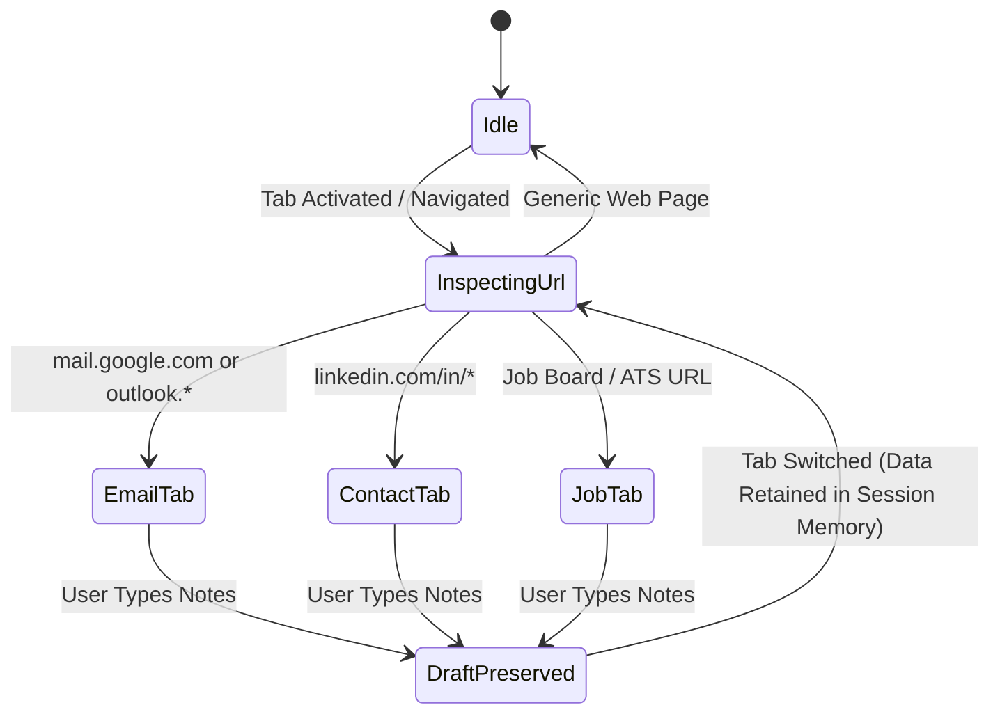
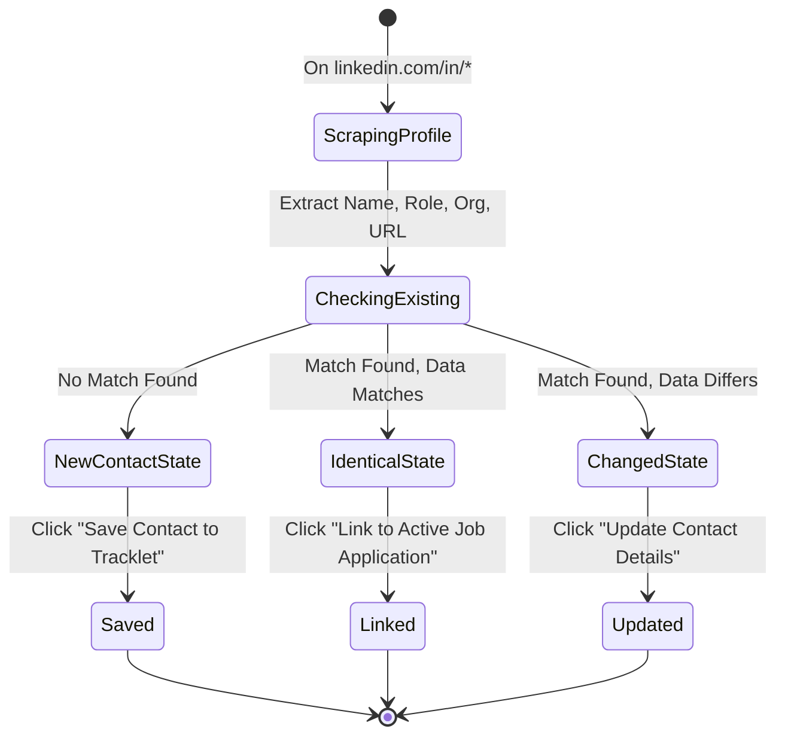
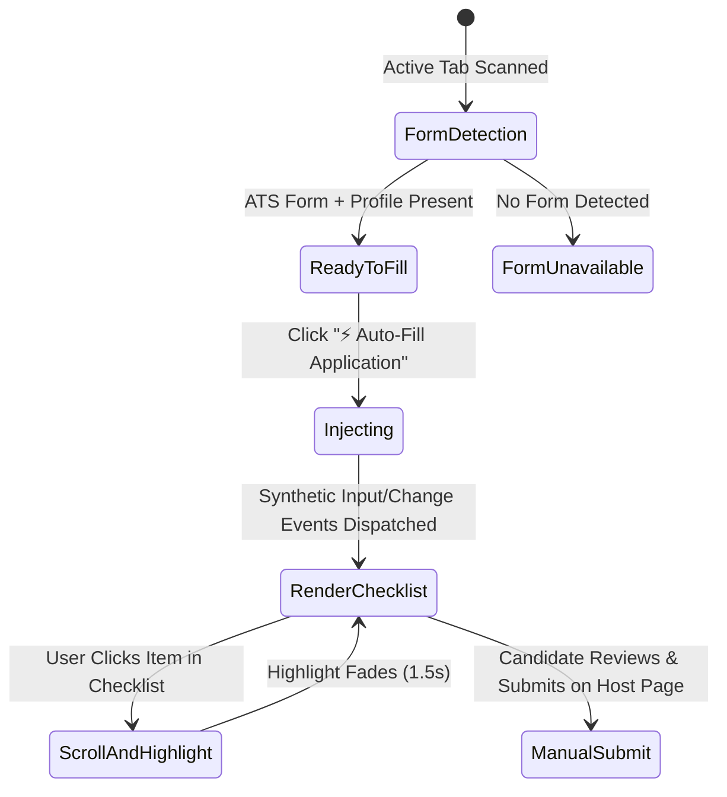
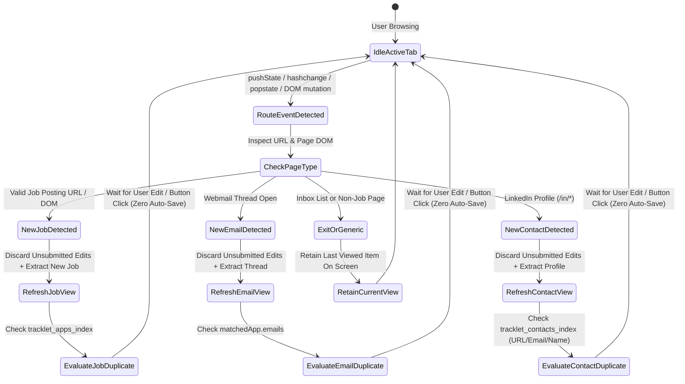

# Data Model: Extension Side Panel Redesign, Contact Clipper & Autofill Readiness

**Feature Directory**: `specs/008-extension-companion-redesign`  
**Date**: 2026-10-05  
**Spec Reference**: [`spec.md`](./spec.md)

---

## 1. Entities & Schema Definitions

### A. Candidate Profile (`CandidateProfile`)
Stored in `chrome.storage.sync` under key `tracklet_candidate_profile_v1` (with fallback to `chrome.storage.local`). Represents the user's primary candidate credentials used by the Autofill Hub.

```typescript
export interface CandidateProfile {
  id: string;                         // UUID or auth user UID
  fullName: string;                   // Complete name, e.g. "Sarah Connor"
  firstName?: string;                 // Explicit or derived given name
  lastName?: string;                  // Explicit or derived family name
  email: string;                      // Primary contact email address
  phone?: string;                     // Primary contact telephone number
  location?: string;                  // City, State/Region, Country (e.g. "San Francisco, CA")
  linkedInUrl?: string;               // Normalized LinkedIn profile URL
  githubUrl?: string;                 // Normalized GitHub profile URL
  portfolioUrl?: string;              // Personal website or portfolio URL
  targetTitle?: string;               // Desired job title, e.g. "Senior Frontend Engineer"
  workAuthorization?: string;         // e.g. "Authorized to work in US without sponsorship"
  preferredResumeName?: string;       // Default resume filename reference
  updatedAt: string;                  // ISO 8601 timestamp
}
```

**Validation & Normalization Rules**:
- `fullName` is required; if `firstName` or `lastName` are missing, they are derived by splitting `fullName` on the first whitespace boundary.
- `email` must match standard RFC email format.
- `linkedInUrl`, `githubUrl`, `portfolioUrl` must start with `http://` or `https://` (auto-prepended if missing).
- Missing optional fields render as gentle "Not configured" tags in the side panel with an inline quick-edit prompt.

---

### B. Contact (`Contact`)
Directly maps to Tracklet's canonical `Contact` interface in `src/types.ts`. Stored in Firestore `/users/{userId}/contacts/{contactId}` and `chrome.storage.local`.

```typescript
export type ContactCategory =
  | 'Mentor'
  | 'Recruiter'
  | 'Hiring Manager'
  | 'Referral'
  | 'Peer / Alumni'
  | 'Other';

export interface Contact {
  id: string;                         // Auto-generated UUID / Firestore document ID
  userId?: string;                    // Authenticated user ID (or 'guest' for local storage)
  name: string;                       // Full name extracted from LinkedIn or job post
  role?: string;                      // Extracted headline or title (e.g. "Talent Lead")
  organization?: string;              // Extracted company or employer (e.g. "Stripe")
  category?: ContactCategory;         // Selected or smart-defaulted category
  email?: string;                     // Optional contact email
  phone?: string;                     // Optional contact phone number
  linkedIn?: string;                  // Canonical LinkedIn URL (e.g. "https://www.linkedin.com/in/username")
  location?: string;                  // Contact geographic location or region
  notes?: string;                     // Private notes or conversation logs
  nextFollowUpDate?: string;          // YYYY-MM-DD
  applicationIds?: string[];          // Array of linked Application IDs
  createdAt?: string;                 // ISO 8601 timestamp
  updatedAt?: string;                 // ISO 8601 timestamp
}
```

**Deduplication & Diffing Logic**:
- An incoming LinkedIn contact matches an existing contact if:
  1. `contact.linkedIn.toLowerCase() === scrapedLinkedInUrl.toLowerCase()`, OR
  2. `contact.name.toLowerCase() === scrapedName.toLowerCase()` AND `contact.organization.toLowerCase() === scrapedCompany.toLowerCase()`.
- **Change Detection**:
  - `hasChanged = (scrapedRole !== contact.role) || (scrapedCompany !== contact.organization) || (scrapedLocation !== contact.location)`.
  - If `!hasChanged` $\rightarrow$ Show `"✓ Saved in Contacts Hub"` with a `"Link to Application"` action.
  - If `hasChanged` $\rightarrow$ Show `"Already in Contacts Hub · Changes Detected"` with an explicit `"Update Contact"` button.

---

### C. Application (`Application` — Tailored CV Extension)
Extends Tracklet's existing `Application` interface in `src/types.ts` with tailored CV attachment attributes:

```typescript
export interface Application {
  id: string;
  userId: string;
  company: string;
  role: string;
  platform: JobPlatform;
  workLocation?: WorkLocation;
  employmentType?: EmploymentType;
  location?: string;
  dateApplied: string;                 // YYYY-MM-DD
  status: ApplicationStatus;
  jobLink?: string;
  emailThreadUrl?: string;
  notes?: string;
  contactEmail?: string;
  contactIds?: string[];
  contacts?: Contact[];
  tasks?: ApplicationTask[];
  emails?: EmailLog[];
  history?: StatusHistoryEntry[];
  logoUrl?: string;
  companyDomain?: string;
  stageUpdatedAt: string;
  createdAt: string;
  updatedAt: string;

  // New Tailored CV Attachment Attributes:
  resumeFileName?: string;            // Name of tailored CV file (e.g. "Saleem_Stripe_Frontend.pdf")
  resumeFileSize?: number;            // File size in bytes (e.g. 148520)
  resumeBlobId?: string;              // Storage reference key in IndexedDB
  resumeUploadedAt?: string;          // ISO 8601 upload timestamp
}
```

---

### D. ATS Form Detection & Field Matching Models

```typescript
export type AtsPlatform = 'greenhouse' | 'lever' | 'workday' | 'generic';

export interface FormDetectionResult {
  ats: AtsPlatform | null;            // Detected ATS provider
  confidence: number;                 // Detection confidence (0.0 to 1.0)
  formElementFound: boolean;          // True if an active application form exists
  formSelector: string;               // CSS selector targeting form container
  fieldsMatched: MatchedField[];       // Array of successfully matched inputs
  unmatchedFields: string[];          // CandidateProfile fields with no match on page
}

export interface MatchedField {
  candidateKey: keyof CandidateProfile; // Target attribute (e.g. "email", "fullName")
  targetSelector: string;               // Unique selector on host page
  fieldType: 'text' | 'email' | 'tel' | 'url' | 'select' | 'textarea' | 'file';
  label: string;                        // Human-readable field label
  confidence: number;                   // Match confidence score
}
```

---

## 2. State Machines & Lifecycles

### A. Contextual Tab Auto-Switching Lifecycle



---

### B. Contact Clipping & Deduplication Lifecycle



---

### C. Form Autofill & Scroll-to-Field Interaction



---

## 3. Real-Time Reactivity & Duplicate State Models

### A. In-Flight Duplicate Recognition State (`EntityDuplicateStatus`)

```typescript
export interface EntityDuplicateStatus {
  isDuplicate: boolean;
  matchedEntityId?: string;
  matchedDisplayLabel?: string;      // e.g. "Acme Corp (Software Engineer)" or "John Doe"
  statusBadgeLabel?: string;         // e.g. "Already tracked in Tracklet (Interview)" or "Already in Contacts Hub"
  primaryButtonLabel: 'Save' | 'Update';
  isButtonEnabled: boolean;          // true if NEW entity OR (isDuplicate && isFormDirty)
  dirtyFields: string[];             // List of field keys that differ from stored entity
}
```

### B. Form Dirty Tracking Model (`FormDirtyState`)
For each entity type (Job, Email, Contact), on initial page extraction or match selection, an immutable baseline snapshot is recorded:
```typescript
interface BaselineFormSnapshot {
  job?: { company: string; role: string; platform: string; location?: string; workLocation?: string; employmentType?: string; notes?: string; stage: string };
  email?: { subject: string; counterparty: string; date: string; time?: string; body?: string; direction: string; advanceStage?: string };
  contact?: { name: string; role?: string; organization?: string; category?: string; email?: string; phone?: string; linkedIn?: string; notes?: string; applicationId?: string };
}
```
Whenever an input event fires:
- Compare current input values against `BaselineFormSnapshot`.
- If differences exist (`dirtyFields.length > 0`), set `isFormDirty = true`, which enables the "Update" button.
- If current input values match baseline, `isFormDirty = false`, disabling the "Update" button to prevent duplicate or redundant submissions.

### C. SPA Reactivity & Idle Context State Machine



