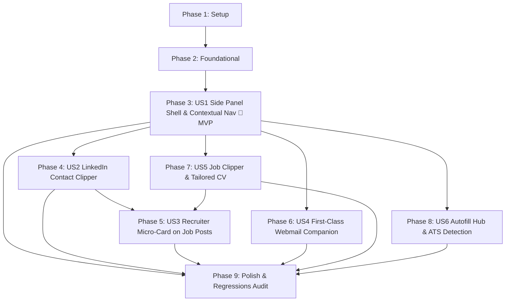

# Tasks: Extension Side Panel Redesign, Contact Clipper & Autofill Readiness

**Input**: Design documents from `/specs/008-extension-companion-redesign/`  
**Prerequisites**: [plan.md](./plan.md) (required), [spec.md](./spec.md) (required), [research.md](./research.md), [data-model.md](./data-model.md), [contracts/](./contracts/), [quickstart.md](./quickstart.md)  
**Tests**: Focused unit test suites included in `tests/unit/` for classification, ATS detection, CV metadata, and tab routing heuristics.  
**Organization**: Tasks are grouped strictly by user story to enable independent implementation and testing of each story.

## Format: `[ID] [P?] [Story] Description`

- **[P]**: Can run in parallel (different files, no dependencies)
- **[Story]**: Which user story this task belongs to (e.g., `[US1]`, `[US2]`, `[US3]`, `[US4]`, `[US5]`, `[US6]`)
- Every task includes exact file paths in descriptions.

---

## Phase 1: Setup (Shared Infrastructure)

**Purpose**: Shared infrastructure and type model extensions supporting side panel capabilities, tailored CVs, and storage contracts.

- [X] T001 Extend `Application` interface in `src/types.ts` with optional tailored CV metadata attributes (`resumeFileName`, `resumeFileSize`, `resumeBlobId`, `resumeUploadedAt`)
- [X] T002 Update `ApplicationRepository` in `src/lib/applicationRepository.ts` to normalize and persist optional tailored CV metadata attributes in Firestore and local storage
- [X] T003 [P] Update CSV export in `src/lib/exportCsv.ts` and CSV import in `src/lib/importCsv.ts` to include optional tailored CV metadata columns
- [X] T004 [P] Update Manifest V3 declaration in `extension/manifest.json` with permissions (`"sidePanel"`, `"tabs"`, `"storage"`) and declare `"side_panel"` with default path `"popup.html"`

---

## Phase 2: Foundational (Blocking Prerequisites)

**Purpose**: Core extension runtime infrastructure, storage contracts, and background routing that MUST be complete before user stories can execute.

**⚠️ CRITICAL**: No user story work can begin until this phase is complete.

- [X] T005 Implement IndexedDB storage utility `TrackletExtensionDB` in `extension/indexedDbResumeStorage.js` with `tailored_resumes` object store adhering to `contracts/candidate-profile-storage.md`
- [X] T006 [P] Implement `CandidateProfile` storage helpers in `extension/profileStorage.js` supporting `chrome.storage.sync` (key: `tracklet_candidate_profile_v1`) with local fallback per `contracts/candidate-profile-storage.md`
- [X] T007 [P] Configure side panel panel behavior (`chrome.sidePanel.setPanelBehavior({ openPanelOnActionClick: true })`) and message dispatch router in `extension/background.js` adhering to `contracts/side-panel-messaging.md`
- [X] T008 Implement unified runtime message receiver in `extension/content.js` to dispatch `GET_PAGE_DATA`, `DETECT_ATS_FORM`, `EXECUTE_AUTOFILL`, and `SCROLL_TO_FIELD` actions per `contracts/side-panel-messaging.md`

**Checkpoint**: Foundation ready — user story implementation can now begin in parallel or sequentially.

---

## Phase 3: User Story 1 - Persistent Chrome Side Panel Shell & Contextual Auto-Switching (Priority: P1) 🎯 MVP

**Goal**: Transform extension from ephemeral popup to a persistent Chrome Side Panel docked next to active web pages, showing live account status, 4-tab segmented navigation (`[📥 Job]`, `[👤 Contact]`, `[✉️ Email]`, `[⚡ Autofill]`), contextual auto-switching based on active tab URL, and tab draft memory preserving in-progress edits.

**Independent Test**: Click extension icon; companion docks on right as persistent Side Panel. Navigate across a job board, a LinkedIn profile (`linkedin.com/in/*`), and Gmail (`mail.google.com`); companion auto-switches to matching tab within 150ms. Edit notes on Job tab, switch tabs, and verify draft text remains fully intact.

### Tests for User Story 1

- [X] T009 [P] [US1] Add unit tests for tab URL classification heuristics (LinkedIn profile vs. job board vs. webmail vs. generic) in `tests/unit/extensionTabContext.test.ts`

### Implementation for User Story 1

- [X] T010 [US1] Add tab lifecycle listeners (`chrome.tabs.onActivated`, `chrome.tabs.onUpdated`) in `extension/background.js` and `extension/popup.js` to detect active tab context changes
- [X] T011 [US1] Implement Contextual Auto-Switching controller in `extension/popup.js` routing `linkedin.com/in/*` to Contact, webmail to Email, and job boards to Job tab
- [X] T012 [US1] Implement Tab Draft Memory manager in `extension/popup.js` saving and restoring uncommitted form inputs across tab transitions in session memory
- [X] T013 [US1] Implement manual override anchoring in `extension/popup.js` so explicit tab clicks remain active until the user navigates to an entirely different web domain

**Checkpoint**: At this point, User Story 1 is fully functional and delivers the complete Side Panel shell MVP.

---

## Phase 4: User Story 2 - LinkedIn Contact Clipper with Category Smart-Defaulting (Priority: P1)

**Goal**: Extract LinkedIn profile information (`linkedin.com/in/*`) into Tracklet Contacts Hub, with intelligent headline-based category smart-defaulting, active job application linking, and change detection with an "Update Contact" button.

**Independent Test**: Navigate to a LinkedIn profile ("Senior Technical Recruiter at Stripe"); open `[👤 Contact]` tab; observe pre-filled name, headline, company, and LinkedIn URL; observe category automatically pre-selected as `Recruiter`; link to an active Stripe application; click "Save Contact to Tracklet"; verify contact created in Contacts Hub; re-inspecting profile shows "✓ Saved in Contacts Hub" badge or "Update Contact" if headline/company changed.

### Tests for User Story 2

- [X] T014 [P] [US2] Add unit tests for headline keyword regex classification (`Recruiter`, `Hiring Manager`, `Mentor`, `Other`) and contact deduplication diffing in `tests/unit/contactClipper.test.ts`

### Implementation for User Story 2

- [X] T015 [US2] Implement LinkedIn profile DOM extractor in `extension/content.js` extracting full name, headline, current organization, location, and canonical LinkedIn URL
- [X] T016 [P] [US2] Implement Category Smart-Defaulting inference engine in `extension/popup.js` matching headline keywords to `Recruiter`, `Hiring Manager`, and `Mentor`
- [X] T017 [US2] Build Contact Clipper UI in `extension/popup.html` and `extension/popup.css` (contact avatar, name/role/org inputs, category pill selector, application link dropdown)
- [X] T018 [US2] Implement contact deduplication, diffing, and "Update Contact" state handling in `extension/popup.js` adhering to `data-model.md`
- [X] T019 [US2] Implement Firestore `/users/{uid}/contacts` persistence and offline sync queue fallback for captured contacts in `extension/popup.js`

**Checkpoint**: At this point, User Stories 1 AND 2 both work independently and seamlessly together.

---

## Phase 5: User Story 3 - Recruiter Micro-Card on Job Posts (Priority: P1)

**Goal**: Detect recruiter or job poster on job postings (LinkedIn, Greenhouse, Lever) and display a Recruiter Micro-Card on the Job Clipper tab that bundles contact creation and bidirectional application linking directly into the "Save Application" action.

**Independent Test**: Open a LinkedIn job post displaying a job poster; in the side panel's Job tab, inspect the Recruiter Micro-Card displaying their name and role with a checked "Add as recruiter contact" checkbox; click "Save Application"; verify both the application and the contact are created and mutually linked (`contactIds` on application, `applicationIds` on contact).

### Tests for User Story 3

- [X] T020 [P] [US3] Add unit tests for recruiter/job poster DOM parsing heuristics across LinkedIn and ATS job postings in `tests/unit/recruiterDetection.test.ts`

### Implementation for User Story 3

- [X] T021 [US3] Implement job poster DOM extraction in `extension/content.js` for LinkedIn job postings (`.job-details-jobs-unified-top-card__job-poster`, hiring team cards) and ATS hosts
- [X] T022 [US3] Refine Recruiter Micro-Card component in `extension/popup.html` and `extension/popup.css` with recruiter avatar, headline badge, and checked-by-default opt-in toggle
- [X] T023 [US3] Implement atomic bundle-on-save transaction in `extension/popup.js` creating the contact, saving the application, and establishing bidirectional `contactIds`/`applicationIds` linking
- [X] T024 [US3] Add "View Contact Details" transition action on Recruiter Micro-Card in `extension/popup.js` transferring scraped profile state directly into the `[👤 Contact]` tab for editing

**Checkpoint**: User Story 3 provides single-transaction job and recruiter bundle saving with zero extra clicks.

---

## Phase 6: User Story 4 - First-Class Webmail Companion (Gmail & Outlook) (Priority: P1)

**Goal**: Elevate existing Gmail and Outlook email thread clipping with active stage & recency ranking for multi-application company matches, 1-click stage advancement on email log, and recruiter contact capture from email senders.

**Independent Test**: Open an interview invite email in Gmail; Email tab extracts sender, subject, date, and sanitized snippet; companion prioritizes active application in `Interview`/`Screening` stage; offers 1-click pipeline advance to "Interview"; click "Log Email to Tracklet"; verify email logged and application stage updated.

### Tests for User Story 4

- [X] T025 [P] [US4] Extend `tests/unit/webmailCompanion.test.ts` with test cases verifying multi-application active stage & recency ranking (`Interview > Screening > Applied > Saved`, newest first)

### Implementation for User Story 4

- [X] T026 [US4] Implement active stage and recency ranking algorithm in `extension/popup.js` to automatically target the best application match when multiple applications exist for an employer
- [X] T027 [US4] Implement multi-match indicator badge and "Switch Job" searchable popover (`app-selector-popover`, `app-search-input`, `app-selector-list`) in `extension/popup.html` and `extension/popup.js`
- [X] T028 [US4] Implement in-flight pipeline stage advancement on email log in `extension/popup.js` updating application status and recording stage history entries
- [X] T029 [US4] Implement opt-in "Add sender as recruiter contact in Contacts Hub" checkbox in `extension/popup.html` and `extension/popup.js`

**Checkpoint**: User Story 4 preserves 100% of existing webmail features while upgrading multi-match precision.

---

## Phase 7: User Story 5 - Modernized Job Clipper Hierarchy & Tailored CV Storage (Priority: P1)

**Goal**: Deliver an executive-level job clipping experience with 40×40px brand avatar (clean Google favicon `sz=128`, brand rejection of 100+ job board domains in `jobBoardRegistry.js`, SVG monogram fallback), stage safety (`Saved`/`Applied` pills, read-only for later stages), compact 2×2 metadata matrix, rich WYSIWYG notes with bidirectional Markdown, and tailored CV upload dropzone linked to applications.

**Independent Test**: Save a job posting on Greenhouse; drop a tailored resume file `Custom_Resume.pdf` into the CV dropzone; save application; verify resume filename/size metadata in application record and binary payload stored in IndexedDB `TrackletExtensionDB` with preview/download access.

### Tests for User Story 5

- [X] T030 [P] [US5] Add unit tests for tailored CV metadata validation, file size limits (max 10MB), and IndexedDB binary conversion in `tests/unit/tailoredCv.test.ts`

### Implementation for User Story 5

- [X] T031 [US5] Implement tailored CV upload dropzone, file input picker, and attachment chip in `extension/popup.html` and `extension/popup.css`
- [X] T032 [US5] Implement tailored CV file capture, binary storage in IndexedDB `TrackletExtensionDB`, and metadata linking (`resumeFileName`, `resumeFileSize`, `resumeBlobId`, `resumeUploadedAt`) in `extension/popup.js`
- [X] T033 [US5] Implement stage safety locks in `extension/popup.js` (mutually exclusive `Saved`/`Applied` pills for new clips; immutable read-only badge for `Screening`, `Interview`, `Offer`, `Rejected`, `Archived`)
- [X] T034 [US5] Verify employer brand identity resolution in `extension/popup.js` (Google Favicon `sz=128`, canonical rejection of job board domains via `jobBoardRegistry.js`, and SVG monogram fallback)

**Checkpoint**: User Story 5 ensures job clipping is modern, bulletproof, and preserves exact submitted CV variants.

---

## Phase 8: User Story 6 - Autofill Hub: Candidate Profile & ATS Form Detection (Priority: P2)

**Goal**: Provide candidate profile summary card with inline quick-edit, real-time ATS form detection for Greenhouse, Lever, and Workday, 1-click safe autofill with synthetic event dispatch, and an interactive checklist in the side panel with 1.5s scroll-to-field highlight on the host webpage.

**Independent Test**: Open a Greenhouse job application page; open `[⚡ Autofill]` tab; observe green "Greenhouse Form Detected (7 fields mapped)" status pill; click "⚡ Auto-Fill Application"; standard fields populate with synthetic events; checklist displays populated fields; click "Phone" item; host page smoothly scrolls to phone input with 1.5s accent halo; form is not submitted.

### Tests for User Story 6

- [X] T035 [P] [US6] Add unit tests for ATS form selector matching (Greenhouse, Lever, Workday) and 4-tier field resolution hierarchy in `tests/unit/atsFormDetection.test.ts`

### Implementation for User Story 6

- [X] T036 [US6] Build Candidate Profile summary card with inline Quick Edit drawer and field validation in `extension/popup.html`, `extension/popup.css`, and `extension/popup.js`
- [X] T037 [US6] Implement ATS form detection engine in `extension/content.js` identifying Greenhouse (`boards.greenhouse.io`), Lever (`jobs.lever.co`), Workday (`myworkdayjobs.com`), and generic forms
- [X] T038 [US6] Implement non-destructive autofill injector in `extension/content.js` setting native element values and dispatching synthetic `input`, `change`, and `blur` events with zero auto-submissions
- [X] T039 [US6] Build interactive populated fields checklist in `extension/popup.html` and `extension/popup.js` displaying populated items (`✓`) and manual alerts (`⚠`)
- [X] T040 [US6] Implement `SCROLL_TO_FIELD` action in `extension/content.js` executing smooth scroll-into-view, input focus, and 1.5s transient accent halo outline

**Checkpoint**: Autofill Hub is fully functional, safe, non-destructive, and provides tactile scroll-to-field visual verification.

---

## Phase 9: Polish & Cross-Cutting Concerns

**Purpose**: System-wide quality assurance, zero-regression audit across all 13 preserved extension features, test suites, and documentation updates.

- [X] T041 [P] Verify 13 preserved features zero-regression checklist in `extension/` (live tab sync, offline queue, context menus, global shortcuts, stage safety, duplicate detection, logo pipeline, structured fields, Markdown engine, recruiter detection, webmail companion, auth sync/guest mode, and auto-dismissal)
- [X] T042 Run full automated verification suite: `npm test` and `npx tsc --noEmit`
- [X] T043 Run production build verification: `npm run build`
- [X] T044 Execute manual end-to-end verification across all 6 scenarios in `specs/008-extension-companion-redesign/quickstart.md`
- [X] T045 [P] Update `extension/README.md` with Side Panel usage, keyboard shortcuts, Autofill Hub instructions, and tailored CV attachment documentation

---

## Dependencies & Execution Order

### Phase Dependencies

- **Setup (Phase 1)**: No dependencies — can start immediately.
- **Foundational (Phase 2)**: Depends on Setup completion — BLOCKS all user stories.
- **User Stories (Phase 3+)**: All depend on Foundational phase completion:
  - User Story 1 (P1): Side Panel Shell & Contextual Navigation (MVP foundation).
  - User Story 2 (P1): LinkedIn Contact Clipper (builds on US1 shell).
  - User Story 3 (P1): Recruiter Micro-Card (integrates with US1 Job tab and US2 contact saving).
  - User Story 4 (P1): Webmail Companion (integrates with US1 Email tab).
  - User Story 5 (P1): Job Clipper & Tailored CV Storage (integrates with US1 Job tab and Phase 2 IndexedDB).
  - User Story 6 (P2): Autofill Hub (integrates with US1 Autofill tab and Phase 2 profile storage).
- **Polish (Phase 9)**: Depends on completion of all user story phases.

### User Story Dependencies



### Parallel Opportunities

- **Setup Phase**: T003 (`exportCsv.ts` / `importCsv.ts`) and T004 (`manifest.json`) can execute in parallel after T001/T002.
- **Foundational Phase**: T005 (IndexedDB), T006 (Profile Storage), and T007 (Background SW) can proceed in parallel.
- **User Stories Phase**:
  - Once US1 is in place, US2 (Contact Clipper), US4 (Webmail Companion), and US5 (Job Clipper & CV) can be implemented independently by separate developers.
  - All test tasks marked `[P]` (`T009`, `T014`, `T020`, `T025`, `T030`, `T035`) can be authored before or in parallel with feature implementation.

---

## Parallel Example: User Story 1

```bash
# Launch test and background listeners in parallel:
Task: "T009 [P] [US1] Add unit tests for tab URL classification heuristics in tests/unit/extensionTabContext.test.ts"
Task: "T010 [US1] Add tab lifecycle listeners in extension/background.js and extension/popup.js"
```

## Parallel Example: User Story 2

```bash
# Launch test suite and DOM extractor in parallel:
Task: "T014 [P] [US2] Add unit tests for headline keyword regex classification in tests/unit/contactClipper.test.ts"
Task: "T016 [P] [US2] Implement Category Smart-Defaulting inference engine in extension/popup.js"
```

---

## Implementation Strategy

### MVP First (User Story 1 Only)

1. Complete Phase 1: Setup (`src/types.ts`, `ApplicationRepository`, `manifest.json`).
2. Complete Phase 2: Foundational (IndexedDB, Profile Storage, Background Service Worker router).
3. Complete Phase 3: User Story 1 (Side Panel docking, 4-tab navigation, Contextual Auto-Switching, Tab Draft Memory).
4. **STOP and VALIDATE**: Test User Story 1 independently in Chrome Side Panel (docking, tab switching across URLs, draft memory).
5. Deliver MVP.

### Incremental Delivery

1. **Increment 1 (MVP)**: Persistent Side Panel Shell + Contextual Auto-Switching (US1).
2. **Increment 2**: LinkedIn Contact Clipper with Category Smart-Defaulting (US2).
3. **Increment 3**: Recruiter Micro-Card on Job Posts with 1-click bundle saving (US3).
4. **Increment 4**: First-Class Webmail Companion with multi-match ranking and stage advance (US4).
5. **Increment 5**: Modernized Job Clipper with Tailored CV upload and IndexedDB storage (US5).
6. **Increment 6**: Autofill Hub with ATS form detection and 1.5s scroll-to-field feedback (US6).
7. **Increment 7**: Full 13-point zero-regression verification, end-to-end quickstart audit, and documentation polish (Phase 9).
